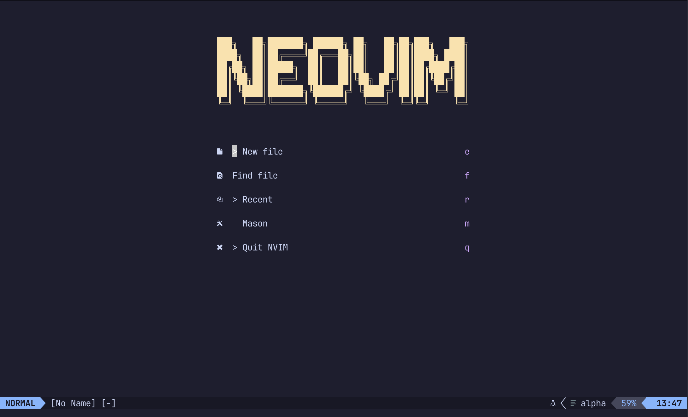
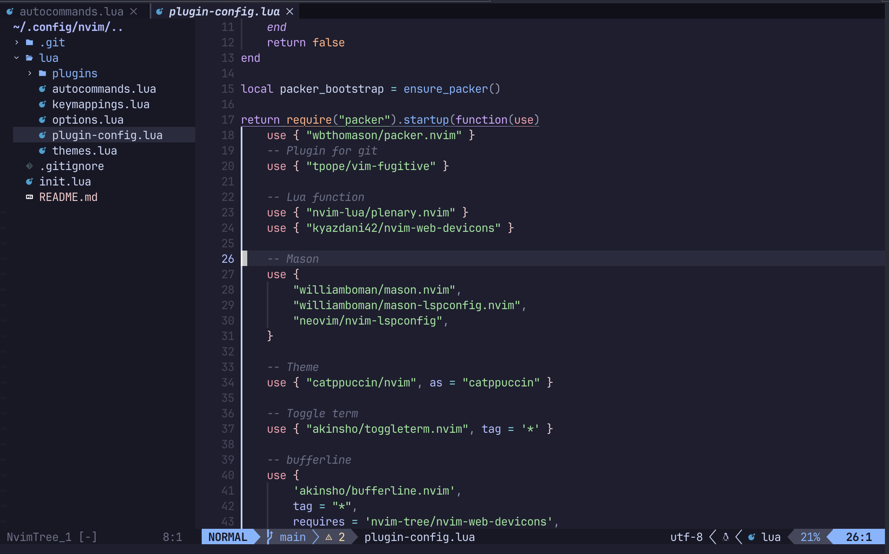

# My Neovim Configuration

## Featured Plugins

My Neovim is powered by a curated selection of Neovim plugins that enhance the coding experience. I am committed to maintaining and improving these plugins to ensure a seamless workflow. Here are some of the key plugins included:

## Table of Contents

- [My Neovim Configuration](#my-neovim-configuration)
  - [Featured Plugins](#featured-plugins)
  - [Table of Contents](#table-of-contents)
  - [Plugin List](#plugin-list)
    - [Packer](#packer)
    - [Vim-fugitive](#vim-fugitive)
    - [toggleterm](#toggleterm)
    - [Alpha](#alpha)
    - [Autopair](#autopair)
    - [Bufferline](#bufferline)
    - [Comment](#comment)
    - [Formatter](#formatter)
    - [Mason](#mason)
    - [Indent-blankline](#indent-blankline)
    - [Leap](#leap)
    - [Lsp](#lsp)
    - [Lualine](#lualine)
    - [Nvim-cmp](#nvim-cmp)
    - [Nvim-tree](#nvim-tree)
    - [Telescope](#telescope)
    - [Todo-comments](#todo-comments)
    - [Treesitter](#treesitter)
    - [Which-key](#which-key)
    - [Ongoing Maintenance](#ongoing-maintenance)

## Plugin List

Let's dive into the plugins I've integrated:

### Packer

[Packer](#) is a lightweight Vim plugin manager that helps streamline the installation and management of other plugins.

### Vim-fugitive

[Vim-fugitive](#) is a Git wrapper for Vim, allowing you to interact with Git repositories directly from within your editor.

### toggleterm

[toggleterm](#) provides a quick and efficient way to toggle terminal windows in Vim, enabling seamless command-line interaction.

### Alpha

[Alpha](#) is a powerful status line plugin that enhances your Vim interface, providing information and visual aids tailored to your workflow.

### Autopair

[Autopair](#) simplifies coding by automatically pairing brackets, parentheses, and other characters, reducing the need for manual keystrokes.

### Bufferline

[Bufferline](#) offers an organized and visually appealing way to manage open buffers and navigate between them with ease.

### Comment

[Comment](#) simplifies code commenting and uncommenting tasks, making it effortless to document your code.

### Formatter

[Formatter](#) automates code formatting according to your preferred coding style, ensuring consistent code appearance.

### Mason

[Mason](#) is a plugin that provides an intuitive way to work with HTML templating, streamlining web development tasks.

### Indent-blankline

[Indent-blankline](#) enhances code readability by visualizing indentation levels with configurable blank lines.

### Leap

[Leap](#) offers advanced cursor movement and selection features, enabling you to navigate your codebase efficiently.

### Lsp

[Lsp](#) integrates the Language Server Protocol into Vim, providing language-specific code analysis and intelligent autocompletion.

### Lualine

[Lualine](#) is a flexible and feature-rich status line that can be customized to display various information and visual elements.

### Nvim-cmp

[Nvim-cmp](#) is a powerful autocompletion plugin for Neovim, making code suggestions and completions a breeze.

### Nvim-tree

[Nvim-tree](#) is a file explorer that allows you to efficiently browse and manage your project's directory structure within Vim.

### Telescope

[Telescope](#) is a versatile fuzzy finder and file search tool, simplifying the process of finding and opening files in your project.

### Todo-comments

[Todo-comments](#) helps you keep track of your code's to-do items and annotations, making it easier to manage and address them.

### Treesitter

[Treesitter](#) is a language parsing tool that enhances syntax highlighting, code folding, and more for various programming languages.

### Which-key

[Which-key](#) simplifies keybinding discovery by providing a popup window with available key mappings and their associated commands.

Feel free to explore these plugins, and consider integrating them into your own Vim environment to tailor it to your specific needs. If you have any questions or need assistance with the setup, please don't hesitate to reach out.

### Ongoing Maintenance

I am dedicated to maintaining and enhancing the plugins integrated into my Neovim. As Neovim evolves and new plugins become available, I will keep the plugins up to date with the latest features and improvements.

If you have suggestions for new plugins or enhancements to existing ones, please feel free to share your ideas and contribute to the ongoing development of this project.
